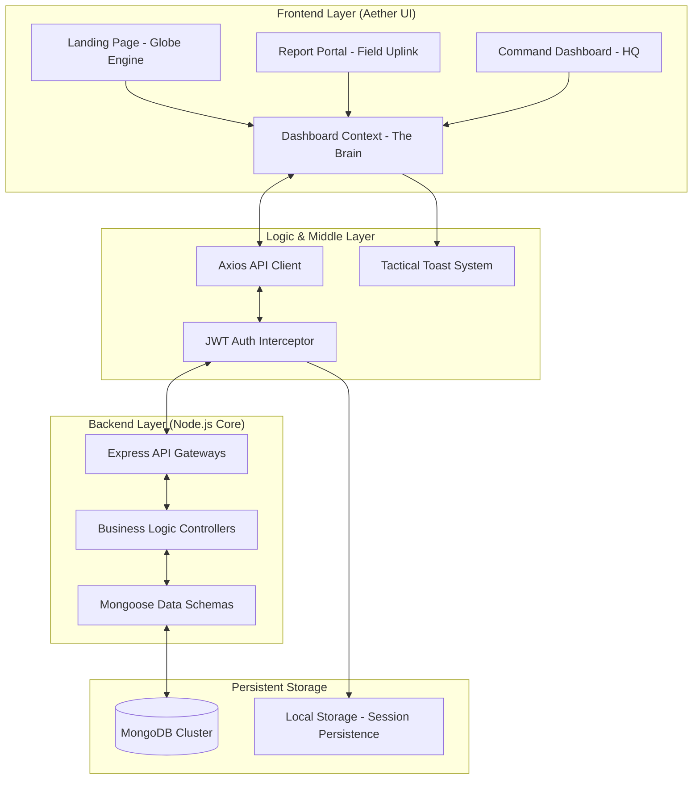
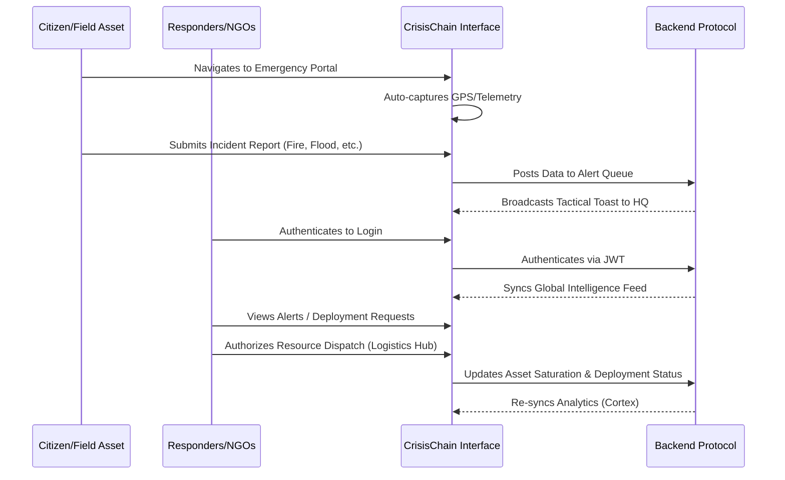

# 🌊 CrisisChain: Tactical Disaster Coordination System

CrisisChain is a premium, real-time login designed for rapid disaster response, resource management, and emergency coordination. It provides a high-fidelity interface for officials to monitor global incidents and for civilians to report emergencies with zero latency.

---

## 🛠 Tech Stack

### Frontend (The Command Interface)
- **Core**: [React 19](https://react.dev/) + [Vite](https://vitejs.dev/)
- **Visuals**: [Three.js](https://threejs.org/) + [React Three Fiber](https://r3f.docs.pmnd.rs/) (Interactive 3D Globe)
- **Styling**: [Tailwind CSS 4.0](https://tailwindcss.com/) (Modern utility-first CSS)
- **Icons**: [Lucide React](https://lucide.dev/) (High-quality tactical icons)
- **Maps**: [React Simple Maps](https://www.react-simple-maps.io/) (Data-driven SVG maps)
- **Charts**: [Recharts](https://recharts.org/) (Dynamic data visualization)
- **Routing**: [React Router 7](https://reactrouter.com/)

### Backend (The Logic Core)
- **Runtime**: [Node.js](https://nodejs.org/)
- **Framework**: [Express.js](https://expressjs.com/)
- **Database**: [MongoDB](https://www.mongodb.com/) + [Mongoose](https://mongoosejs.com/)
- **Security**: [JWT Authentication](https://jwt.io/) & [Bcrypt.js](https://github.com/kelektiv/node.bcrypt.js)
- **Integration**: [Axios](https://axios-http.com/) (Custom Interceptors with Bearer Token support)

---

## 🏗 System Architecture Diagram

---

## 🛰 System Workflow Diagram

---

## 📂 Detailed Page Descriptions

### 1. Landing Page (The Observation Deck)
*   **Purpose**: The entry point for all users, providing a global view of current disaster status.
*   **Key Features**:
    *   **3D Globe Engine**: An interactive, rotating globe with live incident markers.
    *   **Mission Intel**: Editorial-style grid explaining system capabilities.
    *   **Navigation**: Quick access to the Official Login and the Emergency Relief Portal.

### 2. Emergency Report Portal (Field Uplink)
*   **Purpose**: Allows civilians and field assets to log emergencies instantly.
*   **Key Features**:
    *   **GPS Telemetry**: One-click geolocation retrieval via browser APIs.
    *   **Incident Triage**: Categorizes events (Fire, Flood, Medical) and sets severity levels.
    *   **Evidence Upload**: Supports "Visual Telemetry" (photos/videos) for responder review.
    *   **Secure Submission**: Direct uplink to the Command Dashboard.

### 3. Admin Dashboard
*   **Purpose**: The primary HQ interface for real-time monitoring.
*   **Key Features**:
    *   **KPI Tracking**: Active Alerts, Success Rate, Average Response Velocity.
    *   **Tactical Map**: Large-scale SVG map plotting all active crisis nodes.
    *   **Live Feed**: Sidebar listing ongoing emergencies sorted by severity.

### 4. Emergency Alerts Feed (The Pulse)
*   **Purpose**: Detailed management of every reported incident.
*   **Key Features**:
    *   **Incident Stream**: A filterable list of all reports (Fire_Protocol, Medical_Protocol, etc.).
    *   **Tactical Detail**: Deep-dive view for each alert including coordinates, time-elapsed, and deployed resources.
    *   **Broadcast System**: Allows coordinators to send global emergency alerts.

### 5. Cortex Analytics (Intelligence HUD)
*   **Purpose**: Data-driven insights for long-term disaster management.
*   **Key Features**:
    *   **Incident Trajectory**: Line charts tracking incident vs. resolution rates.
    *   **Vector Taxonomy**: Pie charts categorizing the distribution of disaster types.
    *   **Asset Saturation**: Visual telemetry of current resource utilization across all sectors.

### 6. Resource Hub (Inventory Core)
*   **Purpose**: Managing the deployment of physical assets and facility capacity.
*   **Key Features**:
    *   **NGO Supply Grid**: Real-time inventory tracking for medical kits, food, and water.
    *   **Facility Status**: Hospital bed capacity and medicine node monitoring.
    *   **Logistics Fleet**: Tracking and authorization of ambulances, trucks, and air support.

---

## ⚡ Current Configuration: "Pure Mock Mode"
To ensure the application remains functional even without a local MongoDB instance, the `DashboardContext.jsx` is currently set to **Mock Mode**.
-   **Immediate Access**: The Login/Signup portals accept any credentials for demonstration.
-   **Session Memory**: Reports submitted in the portal are saved to local state for the duration of the session.
-   **Auth Persistence**: User roles and sessions are maintained in LocalStorage via the `AuthContext` logic.

© 2026 CrisisChain // THE_SOVEREIGN_OBSERVER
