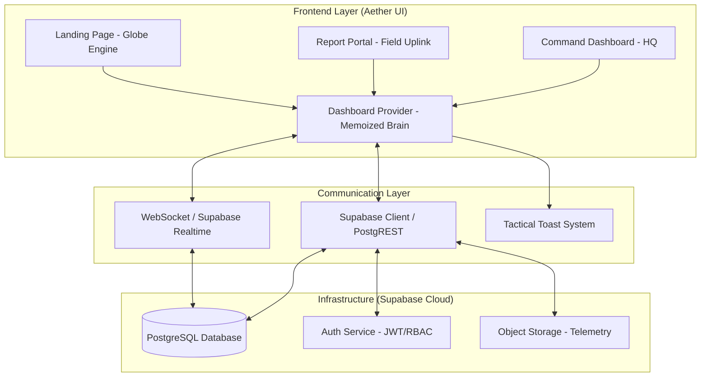

# 🌊 CrisisChain: Tactical Workflow & Architecture

CrisisChain is a premium, real-time tactical dashboard designed for rapid disaster coordination. It provides a high-fidelity interface for officials to monitor live incidents and for responders to manage resources with zero latency.

---

## 🛠 Modern Tech Stack

### Frontend (The Command Interface)
- **Framework**: [React 19](https://react.dev/) + [Vite](https://vitejs.dev/)
- **Mapping Engine**: [Leaflet.js](https://leafletjs.com/) (Satellite imagery + Marker Clustering)
- **Styling**: [Tailwind CSS 4.0](https://tailwindcss.com/) + Vanilla CSS (Hardware-accelerated layouts)
- **Icons**: [Lucide React](https://lucide.dev/) (Tactical iconography)
- **Visuals**: [Three.js](https://threejs.org/) (Interactive 3D Landing Globe)
- **Data Flow**: [DashboardContext](src/context/DashboardProvider.jsx) (Strictly memoized state provider)

### Backend (The Infrastructure)
- **Database**: [Supabase PostgreSQL](https://supabase.com/) (Tactical Data Persistence)
- **Real-time**: [Supabase Realtime](https://supabase.com/realtime) (WebSocket-driven updates)
- **Auth**: [Supabase Auth](https://supabase.com/auth) (JWT & Role-based access control)
- **Storage**: [Supabase Storage](https://supabase.com/storage) (Incident telemetry uploads)

---

## 🏗 System Architecture Diagram

---

## 🛰 Tactical Workflow

### 1. Incident Origination (Field Uplink)
*   **Action**: A field asset or citizen submits an emergency report via the **Report Portal**.
*   **Logic**: Geolocation is captured and the payload is sent to the `incidents` table.
*   **Sync**: Supabase Realtime broadcasts a "New Incident" event to all active dashboards.

### 2. Command Awareness (HQ)
*   **Action**: The **Tactical Map** renders a high-contrast pulse at the coordinates.
*   **Logic**: The `MapPanel` uses a **Persistent Layer** for selected markers to prevent rendering flicker.
*   **Insight**: `LiveAlertsPanel` updates its stream sorted by priority and proximity.

### 3. Resource Engagement (Command)
*   **Action**: A commander clicks **ENGAGE_RESPONSE** on the tactical box.
*   **Logic**: An RPC call updates the incident status to `ACTIVE`.
*   **Allocation**: Resources (Medical Kits, Search Teams) are subtracted from the `Resource Hub` and assigned to the incident node.

### 4. Intelligence Analytics (Cortex)
*   **Action**: `Analytics.jsx` processes real-time data to visualize response velocity.
*   **Logic**: Uses **useMemo** to transform raw table data into optimized chart vectors without blocking the UI thread.

---

## ⚡ Performance Optimizations
- **Stable Function References**: All dashboard actions are wrapped in `useCallback` to prevent context value changes during background simulation cycles.
- **Flexbox Stability**: Eliminated `fixed` positioning to stop layout jumps during sidebar toggles.
- **Lazy Loading**: Tactical panels are loaded as needed to maintain high interaction speed.

---
© 2026 CrisisChain // THE_SOVEREIGN_OBSERVER
